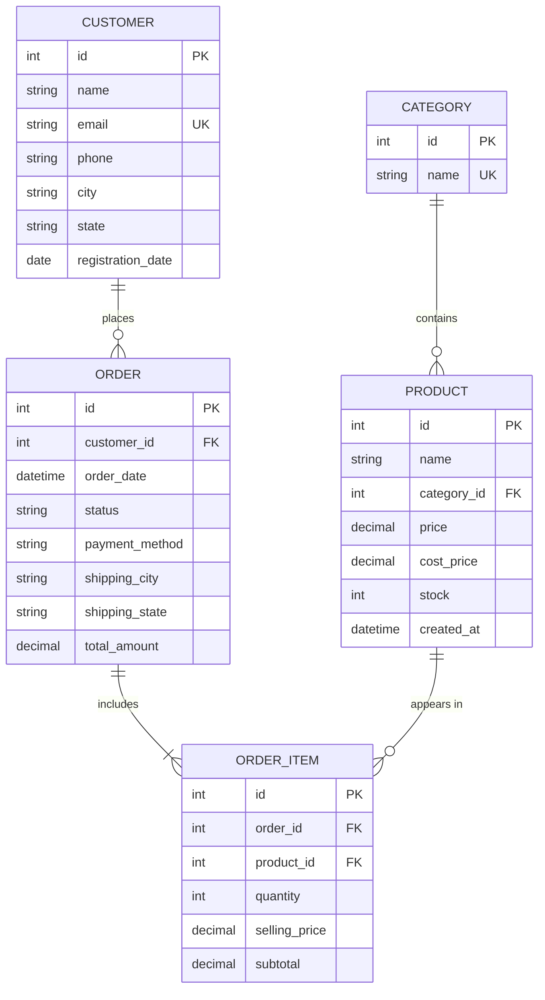

# SalesPulse ⚡ — E-Commerce Management & Sales Analytics Suite

A modern, production-grade Django & Python web application designed for comprehensive e-commerce transaction management and real-time business analytics. Built with **Django**, **SQLite**, **Pandas**, **NumPy**, and **Plotly**.

---

## 📌 Project Overview

**SalesPulse** enables retail managers and business analysts to manage the complete sales lifecycle—from customers and catalog inventory to multi-item orders. It automatically processes transactional history into executive Key Performance Indicators (KPIs) and interactive visualizations, featuring a high-performance CSV ingestion pipeline powered by Pandas with smart column auto-mapping.

---

## ✨ Features

- **Authentication & Role Access**: User registration, login, logout, protected routes with `@login_required`, and Django Admin integration.
- **Customer Directory**: Full CRUD management with location tracking, contact records, order history counting, and instant search.
- **Catalog & Inventory Control**: Categories and products with cost price, current selling price, and stock threshold indicators (*In Stock*, *Low Stock*, *Out of Stock*).
- **Multi-Line Order Management**:
  - Live subtotal and order total calculation.
  - Line-item architecture tracking **historical sold prices** independently from future catalog price updates.
  - Automated stock decrementing upon order confirmation.
- **Real-Time Analytics Dashboard**:
  - **7 Primary KPIs**: Total Revenue, Valid Orders, Registered Customers, Total Units Sold, Average Order Value (AOV), Gross Profit, and Repeat Customer Rate.
  - **Automated Insights**: Highest revenue category, top product, most profitable category, leading sales city, and repeat customer revenue share.
  - **8 Interactive Plotly Visualizations**:
    1. Monthly Revenue Trend (Line Chart)
    2. Monthly Order Volume (Bar Chart)
    3. Category Revenue Comparison (Bar Chart)
    4. Category Profit Breakdown (Bar Chart)
    5. Top 10 Best-Selling Products (Horizontal Bar Chart)
    6. Geographic Sales Distribution by City (Bar Chart)
    7. Order Status Distribution (Donut Chart)
    8. Customer Retention & Repeat Behavior (Donut Chart)
- **Pandas Bulk CSV Pipeline**:
  - Upload raw e-commerce CSV files.
  - Automated cleaning, type coercion, missing value handling, and atomic database persistence.

---

## 🛠️ Technology Stack

| Layer | Technologies |
|---|---|
| **Backend Framework** | Python 3.11+, Django 5.2 (MVT Architecture) |
| **Database & ORM** | SQLite, Django ORM (Foreign Keys, Aggregations, Atomic Transactions) |
| **Data Analytics** | Pandas, NumPy (Vectorized arithmetic, GroupBy, datetime periods) |
| **Data Visualization** | Plotly (Interactive Web Visualizations) |
| **Frontend** | HTML5, CSS3, Bootstrap 5, Bootstrap Icons, Vanilla JavaScript |
| **Version Control** | Git & GitHub |

---

## 🏛️ Database Architecture & ER Design



### Key Architectural Concepts for Interviews

1. **Order vs OrderItem (1-to-Many Bridge)**:
   An `Order` represents the overall transaction/invoice, while `OrderItem` represents an individual line item. This normalizes many-to-many relationships between Orders and Products, allowing distinct quantities, discounts, and item-level tracking.
2. **Historical Pricing Preservation**:
   `Product.price` reflects current catalog pricing. `OrderItem.selling_price` permanently captures the exact price at the moment of purchase. If a product price increases next month, past financial invoices and audit ledgers remain immutable and accurate.
3. **Item-Level Profit Calculation**:
   $$\text{Profit} = (\text{OrderItem.selling_price} - \text{Product.cost_price}) \times \text{OrderItem.quantity}$$

---

## 🚀 Getting Started & Local Setup

### 1. Prerequisites
Ensure you have Python 3.10+ installed.

### 1. Clone the Repository
```bash
git clone https://github.com/adipat/SalesPulse.git
cd SalesPulse
```

### 3. Create & Activate Virtual Environment (Optional if using global environment)
```bash
python -m venv venv
# On Windows PowerShell:
.\venv\Scripts\Activate.ps1
```

### 4. Install Dependencies
```bash
python -m pip install django pandas numpy plotly
```

### 5. Apply Migrations & Seed Sample Data
```bash
python manage.py migrate
python manage.py seed_data
```
> The `seed_data` command generates an initial superuser (`admin` / `admin123`) and 30+ realistic transactions spanning multiple months across Indian cities.

### 6. Run the Development Server
```bash
python manage.py runserver
```

Open your browser at **[http://127.0.0.1:8000/](http://127.0.0.1:8000/)**.

- **Dashboard**: `http://127.0.0.1:8000/dashboard/`
- **Default Credentials**: Username: `admin` | Password: `admin123`
- **Django Admin**: `http://127.0.0.1:8000/admin/`

---

## 📊 CSV Import Pipeline Demonstration

A ready-to-test CSV file (`sample_sales_data.csv`) is provided in the project root.
1. Navigate to **CSV Import (Pandas)** in the sidebar.
2. Select `sample_sales_data.csv` and click **Ingest & Process CSV**.
3. View the instant summary of rows parsed, records created, and updated dashboard metrics!
