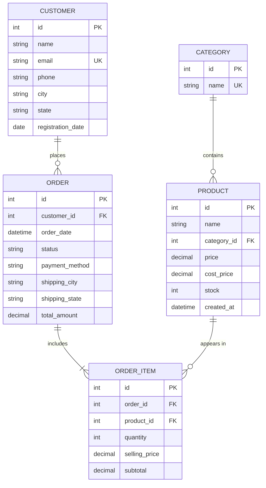

<div align="center">

# ⚡ SalesPulse

### Real-Time E-Commerce Management & Sales Analytics Suite

[](https://salespulse-hpj8.onrender.com)
[](https://python.org)
[](https://djangoproject.com)
[](https://pandas.pydata.org)
[](https://plotly.com)
[](https://salespulse-hpj8.onrender.com)

<br/>

**A modern, production-grade Django web application for comprehensive e-commerce transaction management and real-time business intelligence — powered by Pandas, NumPy, and Plotly.**

[🌐 Live Demo](https://salespulse-hpj8.onrender.com) · [📖 Features](#-features) · [🛠️ Tech Stack](#️-technology-stack) · [🚀 Quick Start](#-getting-started--local-setup)

</div>

---

## 🎯 What is SalesPulse?

**SalesPulse** is a full-stack analytics platform that empowers retail managers and business analysts to manage the complete sales lifecycle — from customers and catalog inventory to multi-item orders. It automatically processes transactional data into executive KPIs and interactive visualizations, featuring a high-performance **Smart ETL CSV ingestion pipeline** powered by Pandas with intelligent column auto-mapping.

> 💡 **Try it now**: Visit the [Live Demo](https://salespulse-hpj8.onrender.com) — Login with `admin` / `admin123`

---

## ✨ Features

### 🔐 Authentication & Access Control
- User registration & login with session management
- Protected routes with `@login_required` decorators
- Django Admin integration for superuser management

### 👥 Customer Directory
- Full CRUD operations with location tracking & contact records
- Order history counting per customer
- Instant search & filtering

### 📦 Catalog & Inventory Control
- Categories and products with cost price, selling price, and stock levels
- Smart stock threshold indicators — *In Stock*, *Low Stock*, *Out of Stock*

### 🛒 Multi-Line Order Management
- Live subtotal and order total calculation
- Line-item architecture tracking **historical sold prices** independently from future catalog price changes
- Automated stock decrementing upon order confirmation

### 📊 Real-Time Analytics Dashboard

**7 Primary KPIs:**
| KPI | Description |
|-----|-------------|
| 💰 Total Revenue | Sum of all completed order values |
| 📋 Valid Orders | Count of confirmed/delivered orders |
| 👥 Registered Customers | Total unique customer base |
| 📦 Total Units Sold | Aggregate quantity across all items |
| 💵 Average Order Value | Revenue ÷ Valid Orders |
| 📈 Gross Profit | Revenue minus cost of goods sold |
| 🔄 Repeat Customer Rate | % of customers with 2+ orders |

**Automated Business Insights:**
- Highest revenue category & top-selling product
- Most profitable category & leading sales city
- Repeat customer revenue share analysis

**8 Interactive Plotly Visualizations:**
1. 📈 Monthly Revenue Trend (Line Chart)
2. 📊 Monthly Order Volume (Bar Chart)
3. 🏷️ Category Revenue Comparison (Bar Chart)
4. 💹 Category Profit Breakdown (Bar Chart)
5. 🏆 Top 10 Best-Selling Products (Horizontal Bar)
6. 🌍 Geographic Sales Distribution by City (Bar Chart)
7. 🍩 Order Status Distribution (Donut Chart)
8. 🔄 Customer Retention & Repeat Behavior (Donut Chart)

### 📥 Smart ETL CSV Pipeline
- **Intelligent Column Auto-Mapping** — automatically maps headers like `Customer Name` → `customer_name`, `Sales` → `selling_price`
- **Email Synthesis** — generates placeholder emails for datasets without email columns
- **Payment Method Normalization** — `COD` → `Cash on Delivery`, `Cards` → `Credit Card`, etc.
- **Resilient Parsing** — handles messy real-world CSVs with `on_bad_lines='skip'`
- **One-Click Sample Downloads** — 3 built-in datasets ready to import
- Only **3 essential columns** required: customer name, product name, and selling price

---

## 🛠️ Technology Stack

| Layer | Technologies |
|---|---|
| **Backend Framework** | Python 3.11+, Django 5.2 (MVT Architecture) |
| **Database & ORM** | SQLite, Django ORM (Foreign Keys, Aggregations, Atomic Transactions) |
| **Data Analytics** | Pandas, NumPy (Vectorized arithmetic, GroupBy, datetime periods) |
| **Data Visualization** | Plotly (Interactive Web Visualizations) |
| **Frontend** | HTML5, CSS3, Bootstrap 5, Bootstrap Icons, Vanilla JavaScript |
| **Deployment** | Render, Gunicorn, WhiteNoise |
| **Version Control** | Git & GitHub |

---

## 🏛️ Database Architecture & ER Design



### Key Architectural Concepts

1. **Order vs OrderItem (1-to-Many Bridge)**:
   An `Order` represents the overall transaction/invoice, while `OrderItem` represents an individual line item. This normalizes many-to-many relationships between Orders and Products, allowing distinct quantities, discounts, and item-level tracking.
2. **Historical Pricing Preservation**:
   `Product.price` reflects current catalog pricing. `OrderItem.selling_price` permanently captures the exact price at the moment of purchase. Past financial records remain immutable even when catalog prices change.
3. **Item-Level Profit Calculation**:
   $$\text{Profit} = (\text{OrderItem.selling\_price} - \text{Product.cost\_price}) \times \text{OrderItem.quantity}$$

---

## 🚀 Getting Started & Local Setup

### Prerequisites
- Python 3.10+ installed

### 1. Clone the Repository
```bash
git clone https://github.com/adipat/SalesPulse.git
cd SalesPulse
```

### 2. Create & Activate Virtual Environment *(Optional)*
```bash
python -m venv venv
# On Windows PowerShell:
.\venv\Scripts\Activate.ps1
# On macOS/Linux:
source venv/bin/activate
```

### 3. Install Dependencies
```bash
pip install -r requirements.txt
```

### 4. Apply Migrations & Seed Sample Data
```bash
python manage.py migrate
python manage.py seed_data
```
> The `seed_data` command generates an initial superuser (`admin` / `admin123`) and 30+ realistic transactions spanning multiple months across Indian cities.

### 5. Run the Development Server
```bash
python manage.py runserver
```

Open your browser at **[http://127.0.0.1:8000/](http://127.0.0.1:8000/)**

| Page | URL |
|------|-----|
| 🏠 Dashboard | `http://127.0.0.1:8000/dashboard/` |
| 🔑 Login | `http://127.0.0.1:8000/login/` |
| 📥 CSV Import | `http://127.0.0.1:8000/import-csv/` |
| ⚙️ Django Admin | `http://127.0.0.1:8000/admin/` |

> **Default Credentials**: Username: `admin` | Password: `admin123`

---

## 📥 CSV Import Demo

1. Navigate to **CSV Import (Pandas)** in the sidebar
2. Download one of the 3 built-in sample datasets or upload your own CSV
3. Click **Ingest & Process CSV**
4. View the instant summary of rows parsed, records created, and updated dashboard metrics!

The smart ETL pipeline handles column mapping, data cleaning, and normalization automatically — just upload and go.

---

## 🌐 Deployment

SalesPulse is deployed on **[Render](https://render.com)** with:
- **Gunicorn** as the WSGI HTTP server
- **WhiteNoise** for efficient static file serving
- **SQLite** as the database (auto-seeded on each deploy)

🔗 **Live URL**: [https://salespulse-hpj8.onrender.com](https://salespulse-hpj8.onrender.com)

---

## 📁 Project Structure

```
SalesPulse/
├── core/                        # Main Django app
│   ├── management/commands/     # Custom management commands (seed_data)
│   ├── templates/core/          # HTML templates (dark theme UI)
│   ├── models.py                # Database models (5 entities)
│   ├── views.py                 # Views + analytics engine + ETL pipeline
│   ├── urls.py                  # URL routing
│   └── admin.py                 # Django admin configuration
├── ecommerce_analytics/         # Django project settings
│   ├── settings.py              # Configuration (WhiteNoise, static files)
│   ├── urls.py                  # Root URL configuration
│   └── wsgi.py                  # WSGI entry point
├── sample_sales_data.csv        # Basic 10-row sample dataset
├── superstore_dataset_test.csv  # 100-row Global Superstore dataset
├── ecommerce_india_online_test.csv  # 149-row Indian E-Commerce dataset
├── requirements.txt             # Python dependencies
├── build.sh                     # Render build script
├── render.yaml                  # Render Blueprint config
└── manage.py                    # Django management utility
```

---

## 📄 License

This project is built for educational and portfolio purposes.

---

<div align="center">

**Built with ❤️ using Django & Python**

⚡ **[Try SalesPulse Live](https://salespulse-hpj8.onrender.com)** ⚡

</div>
